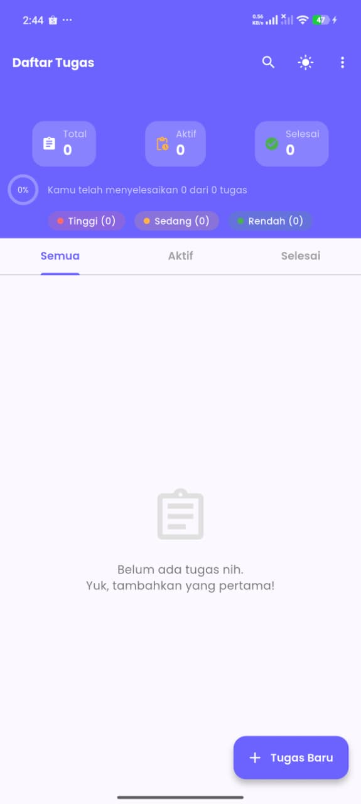
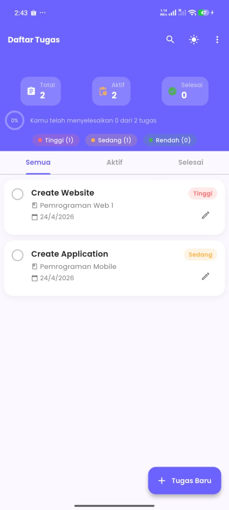
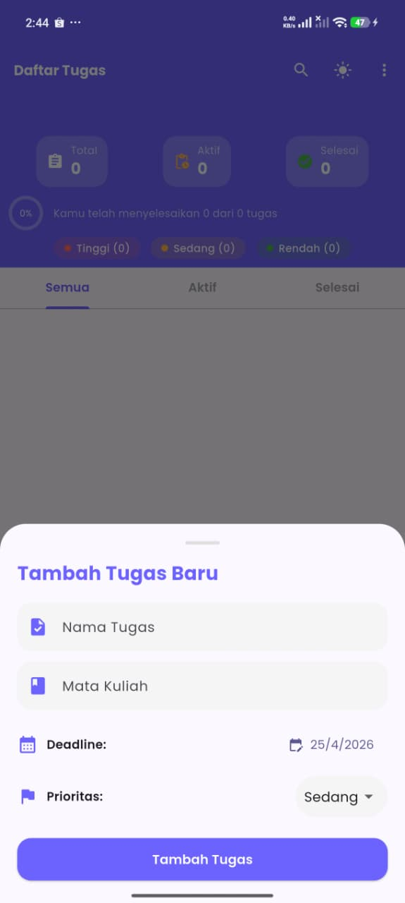

<div align="center">
  
  <h1>🎓 My College Tasks</h1>
  
  <p>
    
  </p>

  <p>
    <a href="#-key-features"></a>
    <a href="#-tech-stack"></a>
    <a href="#-getting-started"></a>
    <a href="LICENSE"></a>
  </p>

  <br/>

  <a href="https://github.com/Gbrnd-ux/my-college-tasks/actions">
    
  </a>
  <a href="https://github.com/Gbrnd-ux/my-college-tasks/stargazers">
    
  </a>
  <a href="https://github.com/Gbrnd-ux/my-college-tasks/network/members">
    
  </a>
  <a href="https://github.com/Gbrnd-ux/my-college-tasks/issues">
    
  </a>
</div>

<br/>

---

## 📊 Project Stats

<div align="center">
  
  
</div>

<br/>

---

## ✨ Key Features

<div align="center">

| 📋 **Task Management** | 🎯 **Priority Levels** | 📊 **Dashboard Stats** |
|:---:|:---:|:---:|
| Add, edit, delete, and check off tasks | High · Medium · Low with distinct colors | Real-time progress & summary |

| 🔍 **Quick Search** | 📑 **Filter Tabs** | 🌙 **Dark Mode** |
|:---:|:---:|:---:|
| Search by task name or course | All · Active · Completed | Auto-saved theme preference |

| 💾 **Local Storage** | 📱 **Responsive UI** | ✨ **Haptic Feedback** |
|:---:|:---:|:---:|
| SharedPreferences for offline data | Adaptive layout for small screens | Subtle vibrations for actions |

| 🧹 **Bulk Delete** | ⏰ **Deadline Alerts** | 📌 **Visual Priority Badges** |
|:---:|:---:|:---:|
| Delete completed or all tasks | Overdue indication with red highlight | Colored labels for instant recognition |

</div>

---

## 📸 Screenshots

<div align="center">
  <table>
    <tr>
      <td></td>
      <td></td>
      <td></td>
    </tr>
    <tr align="center">
      <td>📊 Dashboard</td>
      <td>📋 Task List</td>
      <td>➕ Add / Edit Task</td>
    </tr>
  </table>
</div>

> Add your own screenshots inside the `screenshots/` folder.

---

## 🛠️ Tech Stack

<p align="center">
  
  
  
  
  
</p>

---

## 🚀 Getting Started

### Prerequisites
- Flutter SDK 3.x or later
- Android Studio / VS Code
- An emulator or physical device

### Installation

```bash
# Clone the repository
git clone https://github.com/Gbrnd-ux/my-college-tasks.git
cd my-college-tasks

# Install dependencies
flutter pub get

# Run the app
flutter run